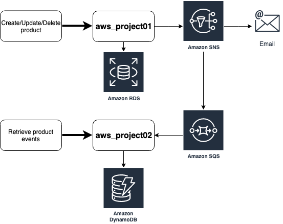

# How to develop Java applications for Amazon Web Services 

This source code repository is related to this [book](http://leanpub.com/amazonwebservice_en) about how to develop **Java** applications using **Spring Boot** to run on **Amazon Web Services** using **Docker** container and [AWS ECS](https://aws.amazon.com/ecs/).

> Para ler essa página em Português, clique [aqui](https://github.com/siecola/aws_project01/blob/master/README.pt-br.md).

In this example, an application with REST services will be built to query events received through an [AWS SQS](https://aws.amazon.com/sqs/) queue and persisted in an [AWS DynamoDB](https://aws.amazon.com/dynamodb) table.

The following is a diagram of the AWS services being used:

- To learn these and other application development concepts using Amazon Web Services, be sure to check out this [book](http://leanpub.com/amazonwebservice_en)!

  Also, check out the other code repositories from this book:

  - [Project01](http://github.com/siecola/aws_project01): In this example, an application will be built with REST services for product registration, in a store context. Such products will be stored in a MySQL database using [AWS RDS](https://aws.amazon.com/rds/). For each product registration, deletion, or change operation, an event will be published to an [AWS SNS](https://aws.amazon.com/sns) topic, allowing integration with other applications. This application will also import invoice files through [AWS S3](https://aws.amazon.com/s3/).
  - [Lambda01](https://github.com/siecola/aws_lambda01): This will be a simple example of a serverless application using functions with [AWS Lambda](https://aws.amazon.com/lambda/), demonstrating how to schedule a function to be executed.
  - [Lambda02](https://github.com/siecola/aws_lambda02): In this second example, we will demonstrate how to execute a **Lambda** function through an event published in the **SNS**.
  - [Lambda03](https://github.com/siecola/aws_lambda03): Here's how to create a **Lambda** function to consume imported files in **S3** and persist its data to a **DynamoDB** table.